<div align="center">

# 📉 Customer Churn Prediction

### An End-to-End Machine Learning Project — EDA → Modeling → Explainability → Deployment

[](https://www.python.org/)
[](https://scikit-learn.org/)
[](https://xgboost.readthedocs.io/)
[](https://streamlit.io/)
[](LICENSE)

**Predicting which customers are about to churn — and why — using the IBM Telco Customer Churn dataset.**

[Overview](#-overview) •
[Results](#-key-results) •
[Architecture](#-project-architecture) •
[EDA](#-exploratory-data-analysis) •
[Modeling](#-modeling--evaluation) •
[Explainability](#-explainability) •
[App Demo](#-deployment-demo) •
[Getting Started](#-getting-started) •
[Business Impact](#-business-recommendations)

</div>

---

## 📌 Overview

Customer churn — when a customer stops doing business with a company — is one of the most expensive problems in subscription-based industries. Acquiring a new customer typically costs far more than retaining an existing one, which makes **early, accurate churn prediction** directly valuable to the business.

This project builds a complete, production-style machine learning pipeline that:

- Explores and cleans a real-world telecom dataset of **7,043 customers**
- Engineers features and handles class imbalance (only ~26.5% of customers churn)
- Trains and compares **three models** (Logistic Regression, Random Forest, XGBoost)
- Tunes the best candidate with **GridSearchCV** (5-fold cross-validation, 54 hyperparameter combinations)
- Evaluates rigorously with ROC-AUC, precision/recall, confusion matrices, and precision-recall curves
- Explains predictions with **SHAP** so results are actionable, not just accurate
- Ships a saved, reusable model **pipeline** and a working **Streamlit app** for live predictions

> 📓 The full analysis lives in [`Customer_Churn_Prediction.ipynb`](Customer_Churn_Prediction.ipynb) — every cell has already been run, so all charts and metrics below are the actual output of that notebook, not mockups.

---

## 🏆 Key Results

| Metric (held-out test set, 1,409 customers) | Tuned XGBoost |
|---|---|
| **ROC-AUC** | **0.840** |
| Accuracy | 0.769 |
| Precision (Churn class) | 0.547 |
| Recall (Churn class) | 0.741 |
| F1-score (Churn class) | 0.630 |
| Best CV ROC-AUC (5-fold) | 0.847 |

The model correctly flags **74% of customers who actually churn** (277 of 374) — the metric that matters most for a retention team, since a missed churner is a lost customer while a false alarm just costs an unnecessary outreach email.

<details>
<summary><b>Full comparison across all three models</b> (click to expand)</summary>

| Model | Accuracy | Precision | Recall | F1 | ROC-AUC |
|---|---|---|---|---|---|
| Logistic Regression | 0.742 | 0.509 | 0.786 | 0.618 | **0.845** |
| Random Forest | 0.770 | 0.565 | 0.580 | 0.573 | 0.827 |
| XGBoost (baseline) | 0.782 | 0.587 | 0.604 | 0.596 | 0.824 |
| **XGBoost (tuned)** | 0.769 | 0.547 | **0.741** | 0.630 | 0.840 |

*Note: Logistic Regression edges out on raw baseline ROC-AUC — the churn signal here is fairly linear (contract type, tenure). XGBoost was still selected for tuning because gradient boosting captures non-linear feature interactions, scales better as more features are added, and pairs naturally with SHAP for interpretability. After tuning, it nearly matches Logistic Regression's ROC-AUC while catching significantly more actual churners (74% vs. 60% recall for the untuned baseline).*

</details>

---

## 🏗 Project Architecture

<p align="center">
  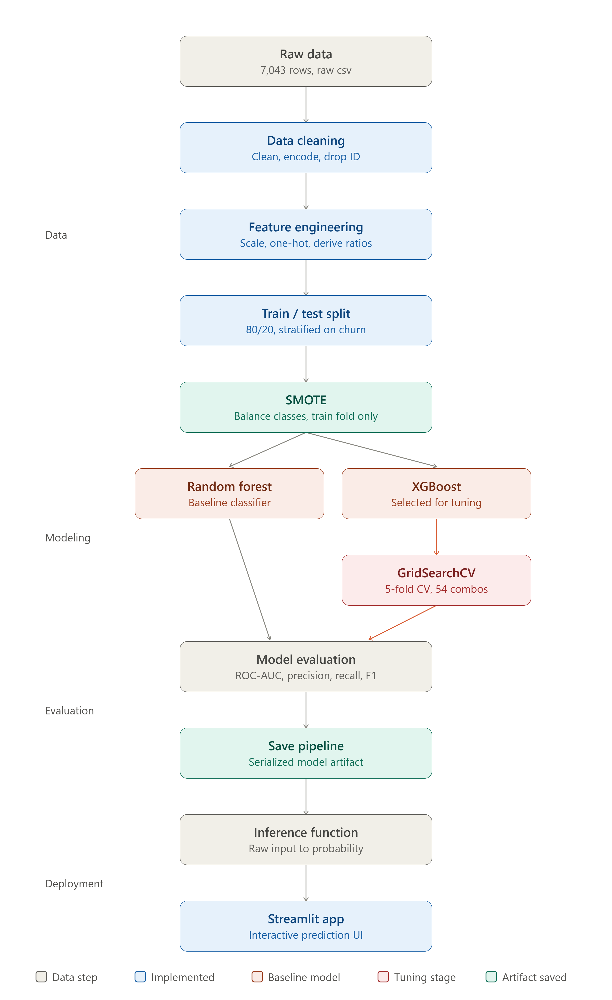
</p>

The pipeline is built entirely as a single scikit-learn `Pipeline` object (preprocessing → SMOTE → classifier), so the exact transformations used in training are guaranteed to be replayed at inference time — no manual re-encoding, no train/serve skew.

---

## 🗂 Dataset

| | |
|---|---|
| **Source** | [IBM Telco Customer Churn](https://github.com/IBM/telco-customer-churn-on-icp4d) — a standard, widely-used industry benchmark |
| **Size** | 7,043 customers × 21 columns |
| **Target** | `Churn` — Yes / No (26.5% positive class → imbalanced) |
| **Features** | Demographics (gender, senior citizen, partner, dependents), account info (tenure, contract, billing, payment method), services subscribed (phone, internet, streaming, security add-ons), and charges (monthly / total) |
| **Data quality** | 0 duplicate rows; 11 records with blank `TotalCharges` (all brand-new customers with `tenure = 0`), cleaned by casting to numeric and filling with 0 |

---

## 🔍 Exploratory Data Analysis

<p align="center">
  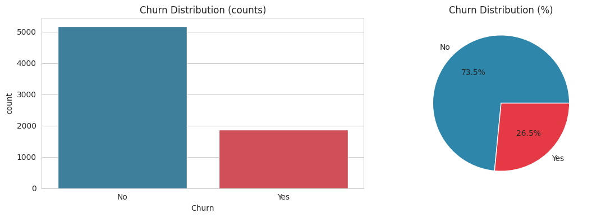
</p>

<table>
<tr>
<td width="50%">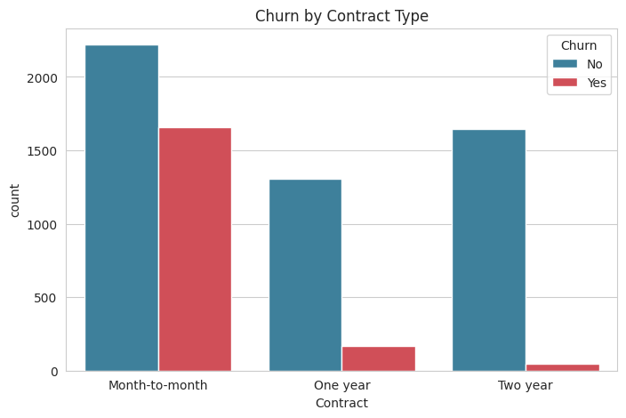</td>
<td width="50%">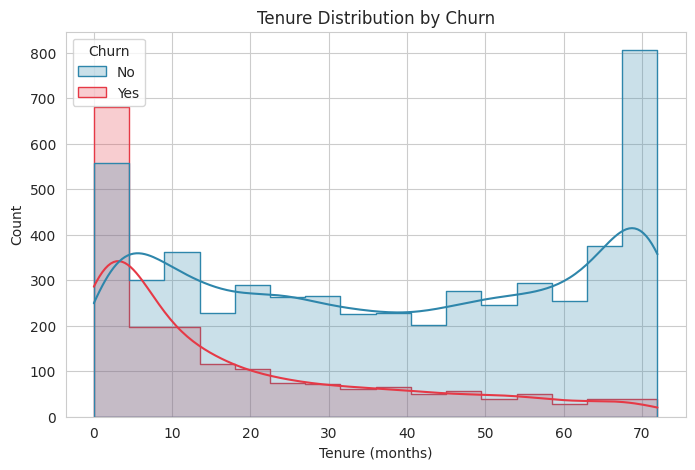</td>
</tr>
</table>

<p align="center">
  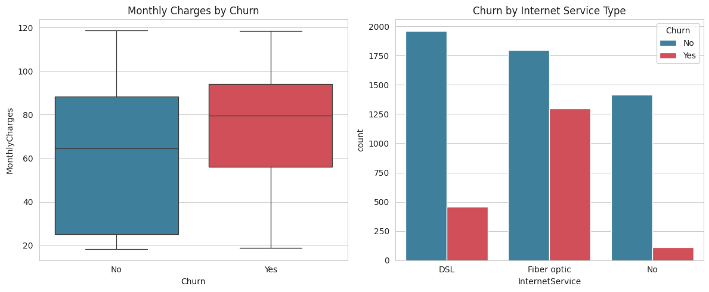
</p>

**What the data shows:**
- 🎯 The target is **imbalanced** (~26.5% churn) — this motivates SMOTE for training and the choice of ROC-AUC / precision-recall over plain accuracy for evaluation.
- 📄 **Month-to-month contracts churn far more** than one- or two-year contracts — the single strongest retention lever in the dataset.
- ⏳ **New customers churn the most.** Risk drops sharply as tenure increases, pointing to a gap in onboarding/early retention.
- 💰 **Higher monthly charges** correlate with higher churn, and **Fiber optic** customers churn more than DSL customers — worth investigating on pricing or service-quality grounds.

---

## ⚙️ Feature Engineering

- Converted `TotalCharges` from text to numeric, filling the 11 blank (new-customer) rows with 0
- Dropped `customerID` (a unique identifier with no predictive signal)
- One-hot encoded all categorical features, scaled numeric features with `StandardScaler`
- Engineered `AvgChargePerMonth = TotalCharges / (tenure + 1)` as an additional signal of customer spend trajectory
- Wrapped everything in a `ColumnTransformer` **inside** the model pipeline, so preprocessing is fit only on training folds — no data leakage during cross-validation

---

## 🤖 Modeling & Evaluation

Three models were trained inside an imbalanced-learn pipeline (`preprocessing → SMOTE → classifier`) and compared on identical train/test splits (80/20, stratified on churn):

<p align="center">
  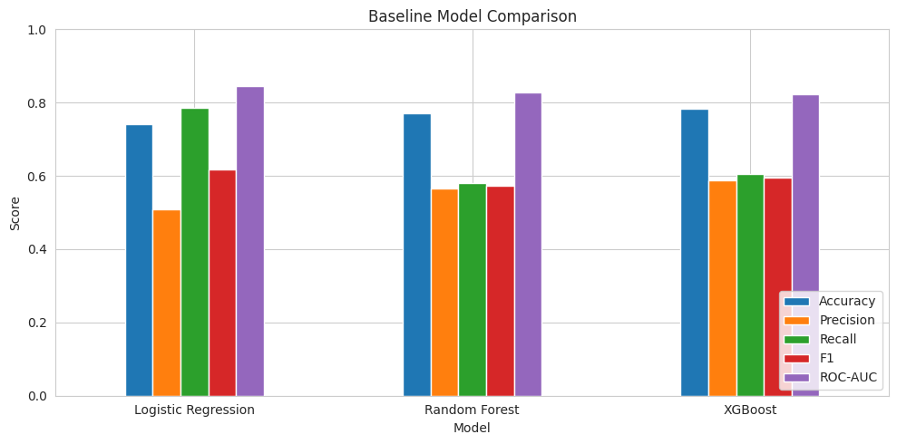
</p>

The best-performing baseline (XGBoost) was then tuned with **`GridSearchCV`** over a 54-combination grid (`n_estimators`, `max_depth`, `learning_rate`, `subsample`), using stratified 5-fold cross-validation optimizing for ROC-AUC:

```python
param_grid = {
    'classifier__n_estimators': [100, 200, 300],
    'classifier__max_depth': [3, 5, 7],
    'classifier__learning_rate': [0.01, 0.1, 0.2],
    'classifier__subsample': [0.8, 1.0]
}
# Best params: n_estimators=300, max_depth=5, learning_rate=0.01, subsample=1.0
# Best CV ROC-AUC: 0.847
```

<table>
<tr>
<td width="50%">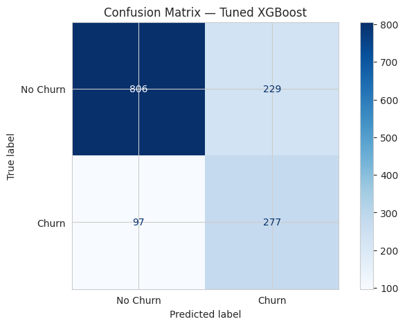</td>
<td width="50%">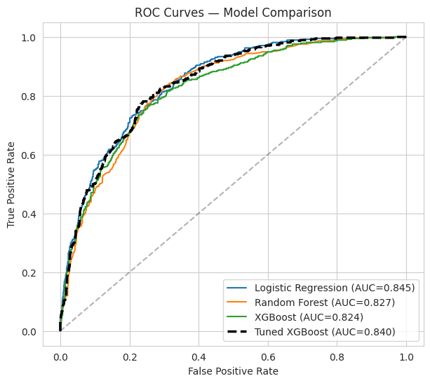</td>
</tr>
</table>

<p align="center">
  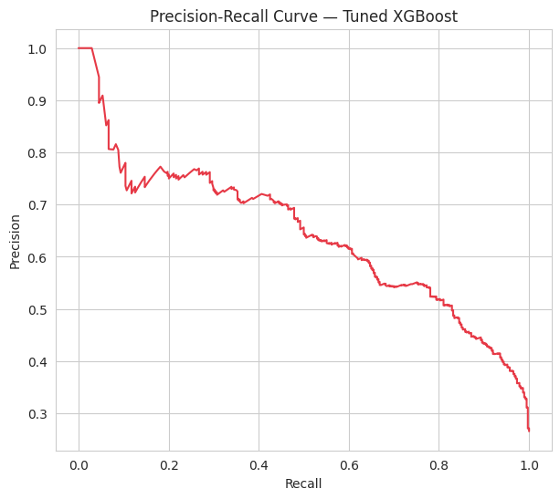
</p>

**Reading the confusion matrix** (806 / 229 / 97 / 277): of 374 customers who actually churned, the model catches **277 (74%)** — at the cost of 229 false alarms among 1,035 loyal customers. That trade-off is tunable: shifting the classification threshold moves the model along the precision-recall curve above, so a retention team can dial recall up or down depending on the cost of a missed churner vs. an unnecessary retention offer.

---

## 🔬 Explainability

Built-in feature importances and **SHAP** values were used to make sure the model's decisions are explainable to a business stakeholder, not just accurate on paper.

<table>
<tr>
<td width="45%">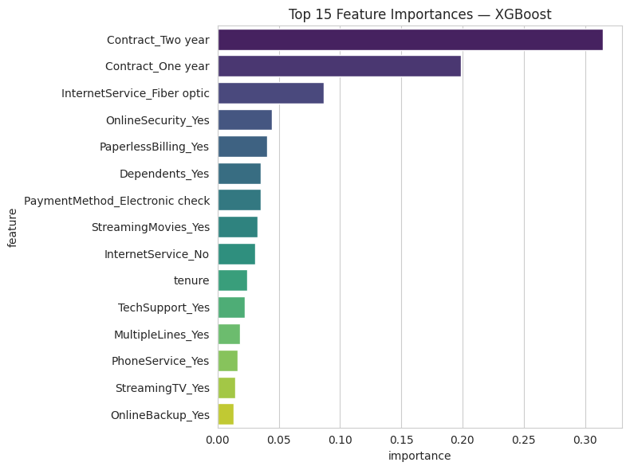</td>
<td width="55%">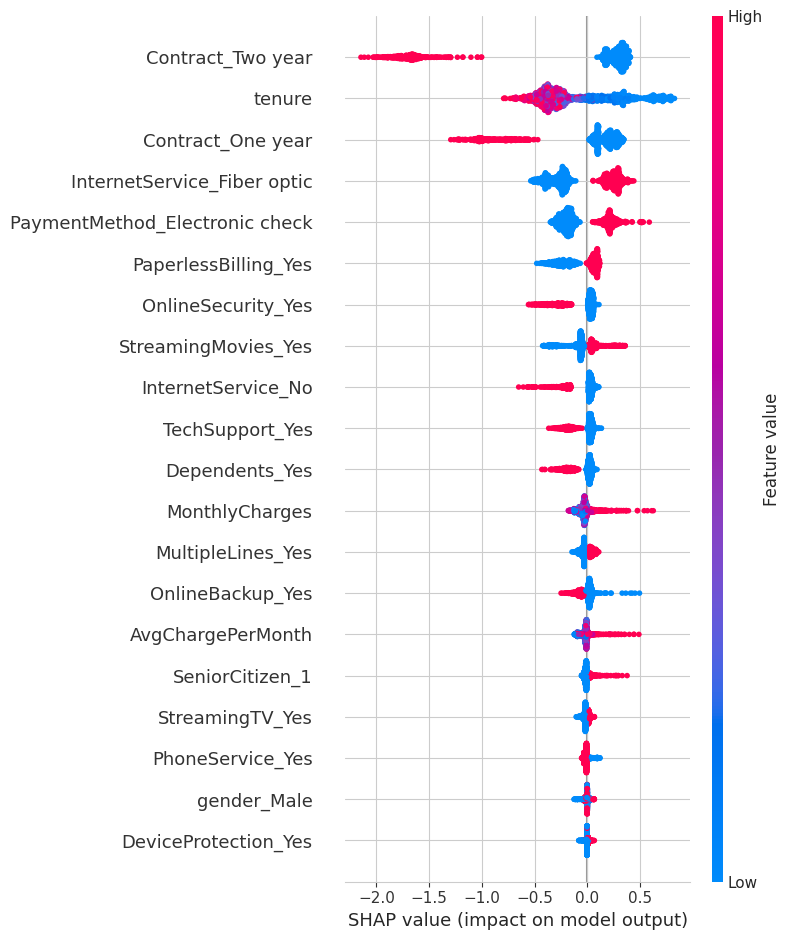</td>
</tr>
</table>

Both views agree on the top drivers: **contract type, tenure, internet service type, payment method, and monthly/total charges.** SHAP additionally shows *direction* — e.g. a two-year contract and longer tenure push predictions toward retention, while month-to-month contracts and Fiber optic service push toward churn.

---

## 🚀 Deployment Demo

The trained pipeline is saved as a single artifact (`churn_model_pipeline.pkl`) and served through a **Streamlit** app (`app.py`) that takes a customer profile and returns a live churn prediction:

<p align="center">
  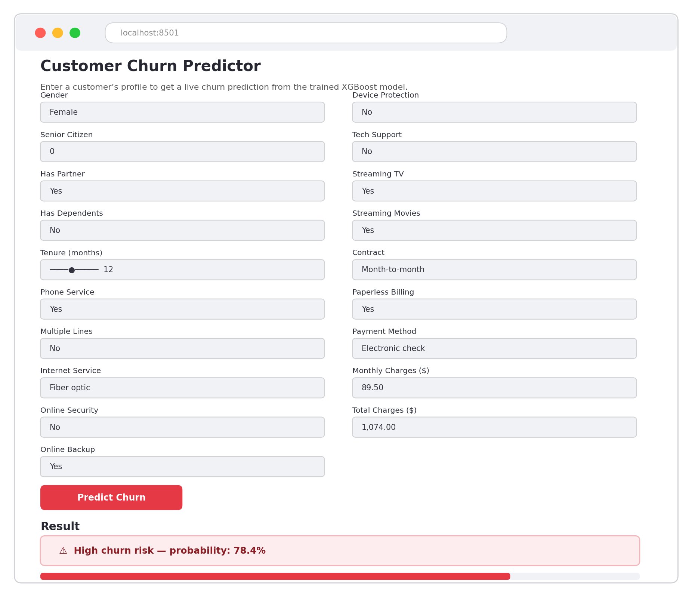
</p>

```python
def predict_churn(customer: dict, model_path="churn_model_pipeline.pkl") -> dict:
    model = joblib.load(model_path)
    input_df = pd.DataFrame([customer])
    input_df["AvgChargePerMonth"] = input_df["TotalCharges"] / (input_df["tenure"] + 1)
    proba = model.predict_proba(input_df)[0, 1]
    pred = model.predict(input_df)[0]
    return {"churn_prediction": "Yes" if pred == 1 else "No",
            "churn_probability": round(float(proba), 4)}
```

Because the saved object is a full scikit-learn `Pipeline`, scoring a new customer takes **one line** — no manual encoding or scaling needed at inference time. The same function could equally be wrapped in a FastAPI/Flask REST endpoint, containerized with Docker, and deployed to any cloud provider (see [Future Work](#-future-work)).

---

## 🛠 Getting Started

### Prerequisites
- Python 3.10+
- pip

### Installation

```bash
# 1. Clone the repository
git clone https://github.com/<your-username>/customer-churn-prediction.git
cd customer-churn-prediction

# 2. Create a virtual environment (recommended)
python -m venv venv
source venv/bin/activate      # Windows: venv\Scripts\activate

# 3. Install dependencies
pip install -r requirements.txt
```

### Run the notebook

```bash
jupyter notebook Customer_Churn_Prediction.ipynb
```

### Run the deployment demo

```bash
streamlit run app.py
```
Then open the local URL Streamlit prints (typically `http://localhost:8501`) and fill in a customer profile to get a live prediction.

> The app loads `churn_model_pipeline.pkl` directly, so no retraining is required — it works out of the box using the model already saved in this repo.

---

## 📁 Project Structure

```
customer-churn-prediction/
├── README.md                        # You are here
├── LICENSE                          # MIT license
├── requirements.txt                 # Python dependencies
├── Customer_Churn_Prediction.ipynb  # Full analysis: EDA → modeling → evaluation → explainability
├── app.py                           # Streamlit deployment demo
├── churn_model_pipeline.pkl         # Saved, trained model (preprocessing + SMOTE + tuned XGBoost)
├── Telco-Customer-Churn.csv         # Raw dataset (IBM Telco Customer Churn)
└── images/                          # Charts and figures used in this README
```

---

## 💡 Business Recommendations

Ranked by the strength of the drivers the model surfaced:

1. **Target month-to-month customers early** — incentivize migration to 1–2 year contracts, the strongest retention lever found.
2. **Strengthen onboarding in the first 3 months** — churn risk is highest for new customers; a structured check-in program could meaningfully cut early cancellations.
3. **Review Fiber optic pricing and service quality** — this segment churns disproportionately more than DSL.
4. **Bundle security / tech-support add-ons** — customers without these services churn more, suggesting they increase perceived value.
5. **Encourage autopay over electronic check** — payment method is a secondary but consistent churn signal.

---

## 🔮 Future Work

- [ ] Wrap `predict_churn()` in a **FastAPI** service and containerize with **Docker**
- [ ] Deploy to a cloud provider (AWS/GCP/Azure) behind a scheduled batch-scoring job
- [ ] A/B test retention offers on customers flagged as high-risk to measure **causal**, not just correlational, impact
- [ ] Add model/data drift monitoring for production use
- [ ] Incorporate additional data sources (support tickets, NPS surveys, usage logs) to strengthen predictive power

---

## 🧰 Tech Stack

`Python` · `pandas` · `NumPy` · `scikit-learn` · `XGBoost` · `imbalanced-learn (SMOTE)` · `SHAP` · `matplotlib` / `seaborn` · `Streamlit` · `joblib`

---

## 📄 License

This project is licensed under the [MIT License](LICENSE).

## 🙋 Author

**[Your Name]**
📧 your.email@example.com · 🔗 [LinkedIn](https://linkedin.com/in/your-profile) · 💻 [GitHub](https://github.com/your-username)

*If you found this project useful, consider giving it a ⭐ — it helps a lot for visibility on placement season!*
